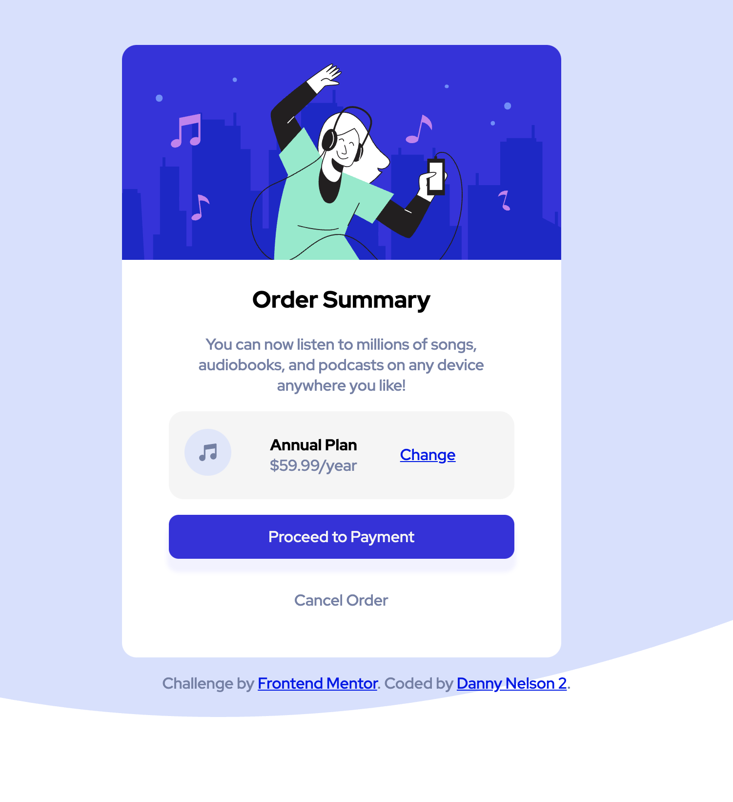

# Frontend Mentor - Order summary card solution

This is a solution to the [Order summary card challenge on Frontend Mentor](https://www.frontendmentor.io/challenges/order-summary-component-QlPmajDUj). Frontend Mentor challenges help you improve your coding skills by building realistic projects. 

## Table of contents

- [Overview](#overview)
  - [The challenge](#the-challenge)
  - [Screenshot](#screenshot)
  - [Links](#links)
- [My process](#my-process)
  - [Built with](#built-with)
  - [What I learned](#what-i-learned)
  - [Continued development](#continued-development)
  - [Useful resources](#useful-resources)
- [Author](#author)
- [Acknowledgments](#acknowledgments)

## Overview

### The challenge

Users should be able to:

- See hover states for interactive elements

### Screenshot

### Links
**I didn't update these**
- Solution URL: [Add solution URL here](https://github.com/TechEdDan2/orderSummaryWithFlexbox)
- Live Site URL: [Add live site URL here](https://techeddan2.github.io/orderSummaryWithFlexbox/)

## My process

For this project, I started by creating the sections I thought I would need to organize the content and then styled it. 

### Built with

- HTML
- CSS
- Flexbox

### What I learned

Since this is my first FrontEnd Mentor project, I am learning more about the process than about new HTML and CSS 

### Continued development

I am new to website development, so I am hoping to get better at my workflow and general knowledge. 

### Useful resources

- [Flexbox Help](https://css-tricks.com/snippets/css/a-guide-to-flexbox/) - This helped me with flexbox. I am sure everyone already uses this website. 

## Author

- Website - [D Nelson 2](TBD)
- Frontend Mentor - [@TechEdDan2](https://www.frontendmentor.io/profile/TechEdDan2)

## Acknowledgments
The YouTubers and other educational resources I have been learning from include: Coder Coder (Jessica Chan), BringYourOwnLaptop (Daniel Walter Scott) 
